Introduction
------------

winPACT() is a successor of [PACT
plugin](https://sccn.ucsd.edu/wiki/PACT) for EEGLAB. Named after
applying phase-amplitude coupling (PAC) using a sliding window so that
it generates time-series of PAC measures. It supports Canolty and
colleagues' modulation index (MI), Özkurt and colleagues' normalized MI,
and Tort and colleagues' Kullback-Leibler divergence. It comes with a
PAC simulator based on Özkurt and Schnitzler (2011) and Kramer et al.
(2008)

### Caution

This application assumes users hopefully use \> 200 cycles of the center
frequency of the LFO (Tort et al., 2010). This means that if you want to
analyze amplitude coupling with 1-Hz phase, the sliding window size is
hopefully \> 200 s! In the same way, 2 Hz for 100 s, 3 Hz for 66.6 s, 4
Hz for 50 s, etc. Using shorter window than this rule of thumb is not
prohibited, but careful empirical test is needed. In the section below,
I will show you how to perform it.

Optimize parameters
-------------------

In this (sliding) window PAC, the choice of window length is critical
because a short window does not detect PAC well. As already mentioned,
Tort et al. (2011) mentioned that the number of cycles is hopefully \>
200. However, as this is a very large number to blindly follow, you may
wonder if there is a way to adjust the number of cycles with objective
criterion, such as sensitivity in SNR. In ECoG data, the targeted PAC is
sometimes directly identifiable by eye. In such situation, having \> 200
cycles maybe an overkill and you may end up with inappropriate side of
the trade off without knowing. This function allows you to test the
limit of SNR in detecting PAC with the specified window length. Some
empirical evidence, obtained from using the PAC simulator and test
functions implemented in this plugin, is shown at the bottom of this
page.

Generate simulatd PAC data
--------------------------

It adds +/-10% frequency jitter (by default; you can change it) to
low-frequency oscillation (LFO), and adds Hamming-windowed
high-frequency oscillation (HFO) to the trough of the LFO with 1/4 pi
radian phase jitter. Use can choose either pink (i.e., 1/f curve) or
white (i.e., uniform distributed) noise with specified noise level. The
generated simulation data are stored into EEG structure. Sampling rate
is fixed to be 1000Hz. The type of data for each channels is as follows.

`1ch: Simulated PAC data (LFO + HFO + Noise)`
`2ch: LFO + Noise`
`3ch: HFO + Noise`
`4ch: Noise `

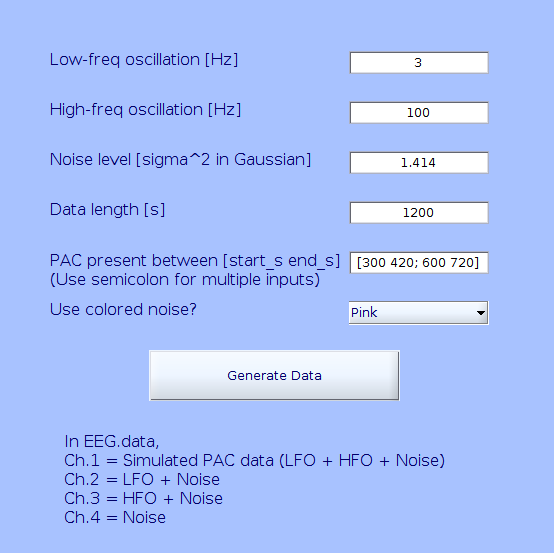

In this example, 4x120000 (120 s) data will be generated, in which PAC
will be present between 300-420 s and 600-720 s. The SNR of the PAC part
is -6dB.

Precompute PAC and data stored
------------------------------

-   The top box: According to amplitude modulation theory, it is
    recommended that the LFO is low-pass filtered with the twice of the
    target center frequency. In this simulation, the generated LFO is
    centered at 3 Hz. Therefore, the band-pass filter of 1-6 Hz is
    applied. Note that the values specified here refers to the pass-band
    edge, in contrast to often-used cutoff frequency (-6dB). For the
    difference of pass-band edge and cutoff frequency, see [this
    page](https://sccn.ucsd.edu/wiki/Firfilt_FAQ#Q._What_are_passband.2C_stopband.2C_transition_band_width.2C_cutoff_frequency.2C_passband_ripple.2Fringing.2C_and_stopband_ripple.2Fattenuation.3F).
-   The second box: the HFO should be band-pass filtered with at least
    \[HFO center freq\] +/- \[LFO center freq\]. In the current example,
    the LFO is only 3 Hz. The optimal bandwidth of 100 +/- 3 Hz cannot
    be missed unless one designs inappropriately aggressive narrow band
    filter.
-   The third box: Next, (sliding) window width is determined. According
    to Tort et al. (2010), \> 200 cycles of the center frequency of the
    LFO is recommended.
-   The fourth box: The number of surrogate data iteration should be
    determined. Do not enter too large value here, otherwise your
    computer may cause buffer overflow.
-   The list box: You can choose a label of event if you want.
-   The 'Load .xlsx' button: Alternatively, you can load Excel file that
    has nx1 column vector of event onset latency (s).
-   The edit box next to the 'Load .xlsx' button: Alternatively, you can
    specify a number series with regular interval. The example here
    shows '60-second sliding window sampled at 30, 60, 90, 120, ...,
    1140, and 1170 s'. This means window overlaps 50%.
-   As an option, you can save the output data into separate Excel files
    for HFO, Modulation Index, uncorrecnormalized Modulation Index,
    KLDivergence, amplitude distribution across phase bins (which has
    dimensions of time + \[(36 phase bins x number of channels) x time\]
    but the two dimensions inside the round bracket are collapsed), and
    p-values (those that pass generalized family-wise error rate
    correction is highlighted by x(-1)).

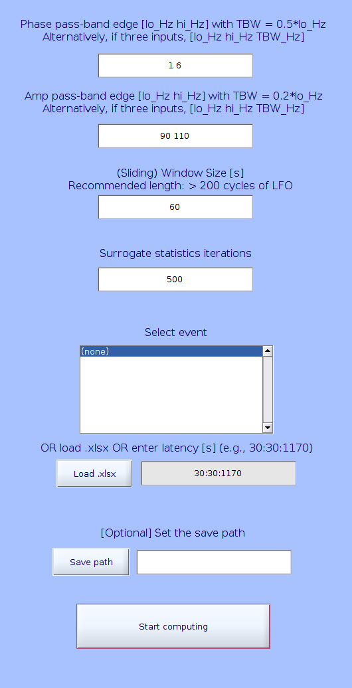

After calculation is done, data are stored under EEG.etc.winPACT. All
the items except for ampDistribAllChan has 1+\[number of channels\] x
\[time points\]. "1+" represents time in second. The ampDistribAllChan
has time + \[(36 phase bins x number of channels) x time\] but the two
dimensions inside the round bracket are collapsed.

Visualize PAC
-------------

You first choose the type of measure to plot, then enter the channel
index to plot. You can also use a slider to move the vertical dotted
line to choose the data point to plot HFO amplitude distribution across
phase bins (Note that two cycles of the phase bins are plotted). When I
analyzed simulated data with -6dB SNR, I obtained the following results.
Subjectively, KLDivergence showed the clearest pattern as expected.
Although I implemented generalized FWER correction, it tends to be
overly conservative and does not show much significant results. This
could be explained by how the circular rotation is done on HFO in
generating surrogate data (phase rotates, after all... probably more
rotation does not mean more randomizing in this case, unfortunately).

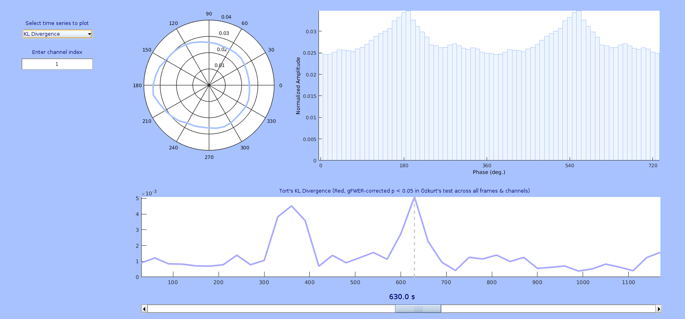

Notes and Discussions
---------------------

I tried other SNR values, but after -6dB the results got rapidly worse.
Also, when I tested shorter windows, the results got worse.

Appendix: Determining SNR limit for various window length
---------------------------------------------------------

### Background

Tort et al. (2011) mentioned that hopefully there are \> 200 cycles of
LFO in the PAC window to assure reliable PAC detection. However, it is
not quantitatively tested yet.

### Methods (04/11/2019 updated)

1.  There were five conditions: Window lengths (60 s, 30 s, 15 s, 7.5 s,
    and 3.75 s) which is equivalent to Cycle numbers (180, 90, 45, 22.5,
    and 11.25)
2.  Forty-window length of data were generated in the following way.
3.  100-Hz HFO coupled with 3-Hz LFO was generated using the simulated
    PAC generator of the current plugin.
4.  One-hundred levels of pink noise, varying from -10 to 10 dB in SNR,
    were generate and mixed with the synthesized PAC signal generated by
    using the function proposed by Özkurt TE, Schnitzler A. (2011).
5.  Data were prepared so that their first half was noise only, and the
    second half was noise plus synthesized PAC.
6.  PAC was quantified the three supported algorithms, namely Canolty's
    Modulation Index, normalized Modulation Index, and KL Divergence.
7.  After performing PAC quantification, two-sample t-test was performed
    between noise only (20 windows) and noise plus PAC (20 windows).
    Obtained t-scores were plotted, Also, the obtained uncorrected
    p-values were corrected with FDR method within each condition and
    measure.

### Results

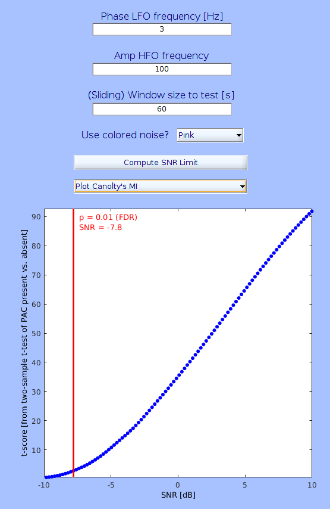
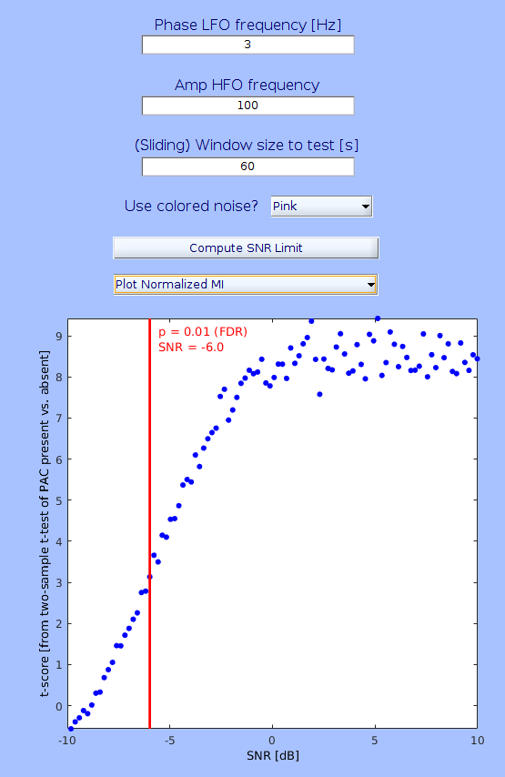
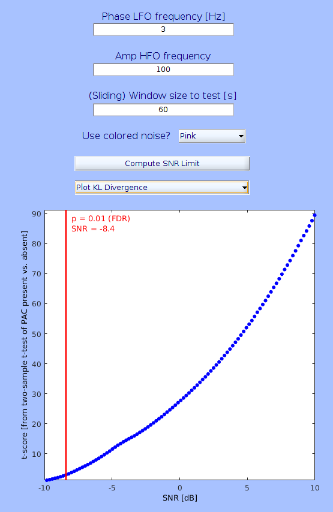

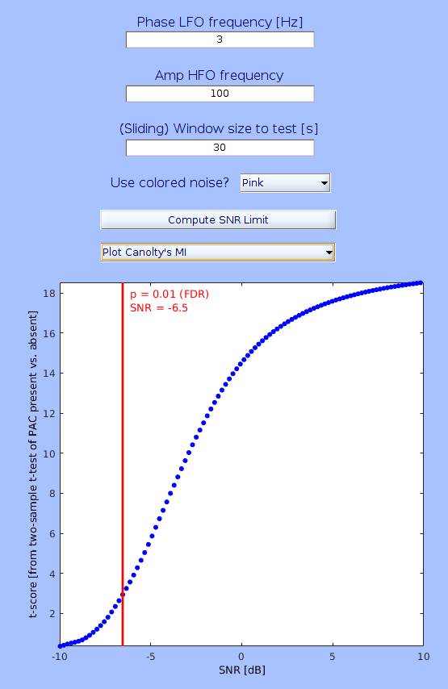
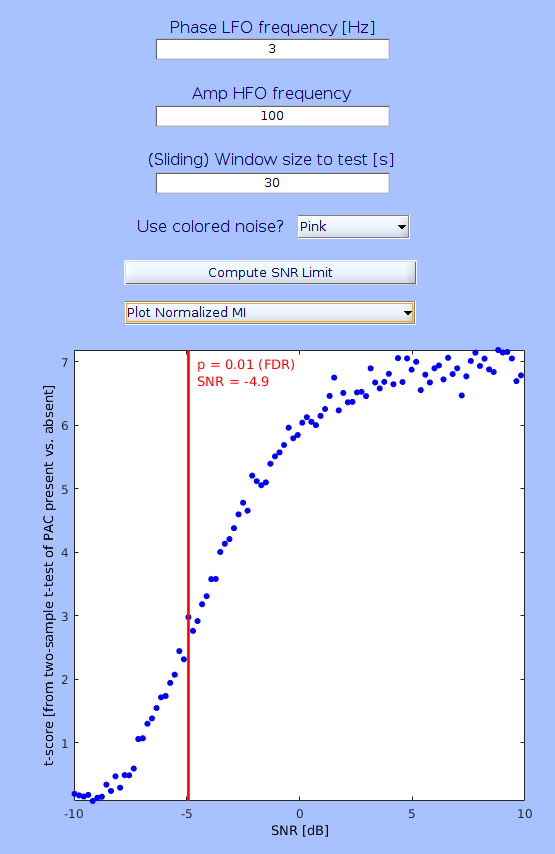
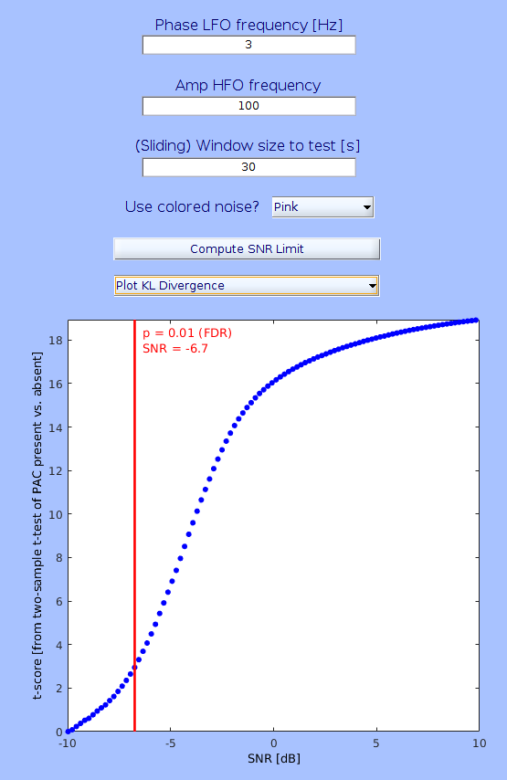

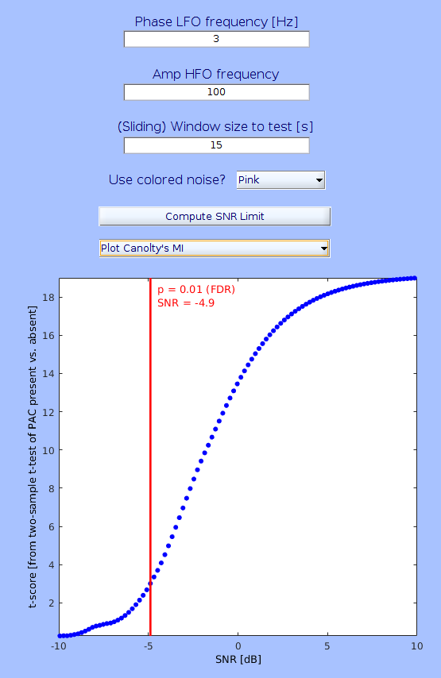
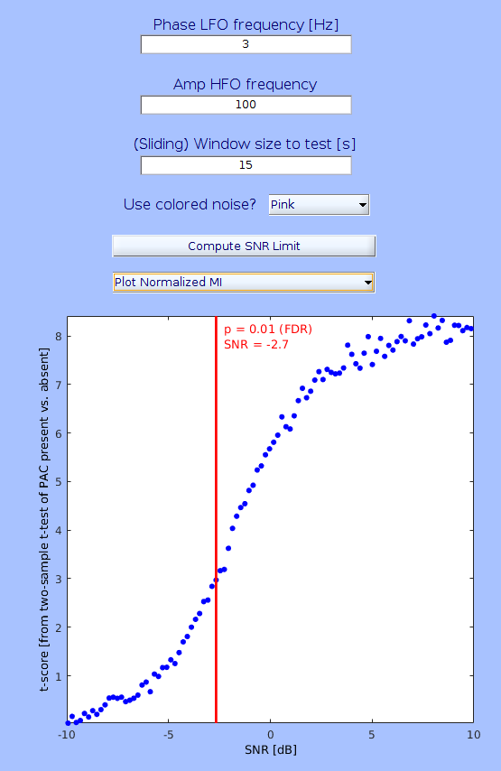
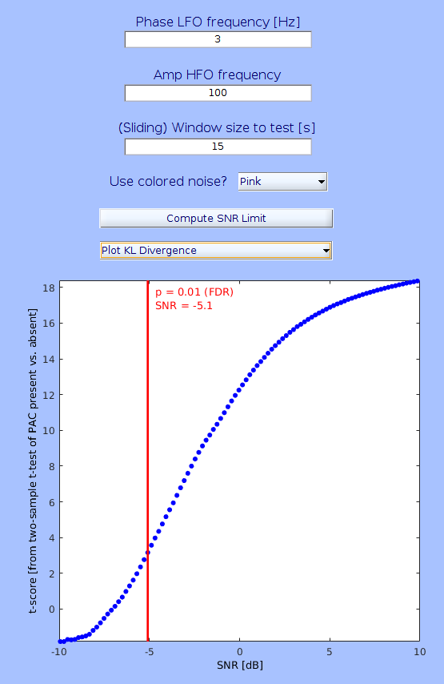

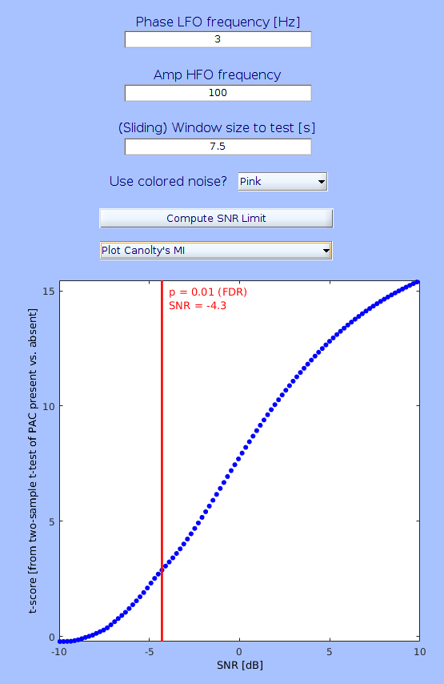
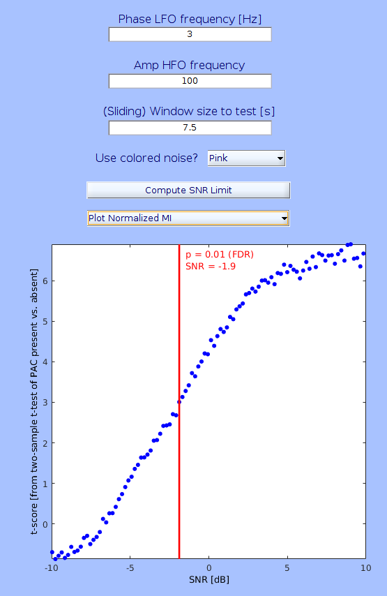
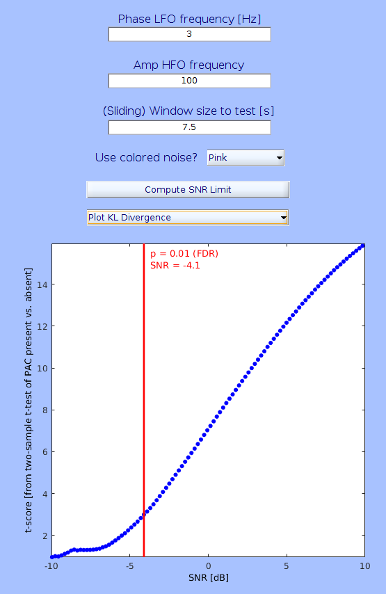

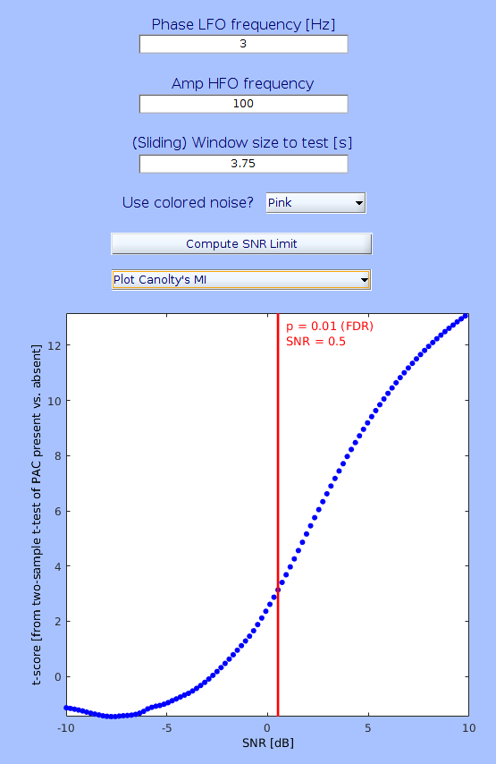
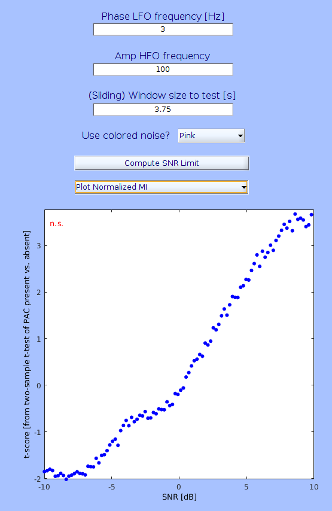
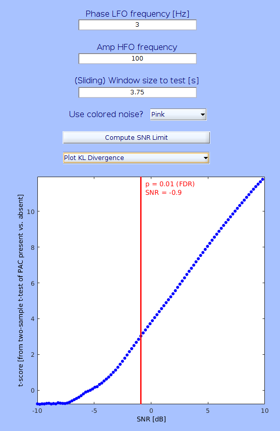

### Conclusion

Shortening the window length deteriorated the SNR limits. Using 22.5
cycles still allowed PAC detection under -4dB SNR i.e., the signal power
is only 40% of the noise power. Under the situation where the targeted
PAC phenomenon is visually identifiable on raw ECoG signal, using 22.5
cycles seems justifiable. Using 11.25 cycle should be avoided, the
normalized MI method failed to detect PAC.

References
----------

Canolty RT, Ganguly K, Kennerley SW, Cadieu CF, Koepsell K, Wallis JD,
Carmena JM. (2006). Proc Natl Acad Sci USA. 107:17356-17361.

Kramer MA, Tort AB, Kopell NJ. (2008). J Neurosci Methods. 170:352–7.

Özkurt TE, Schnitzler A. (2011). J Neurosci Methods. 201:438-443.

Tort AB, Komorowski R, Eichenbaum H, Kopell N. (2010). J Neurophysiol.
104:1195-1210.